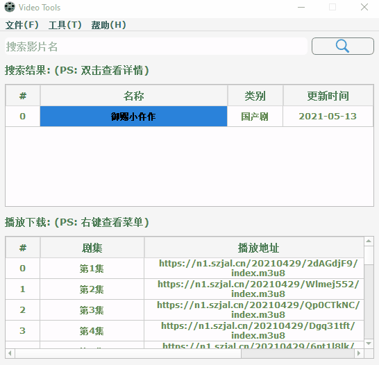
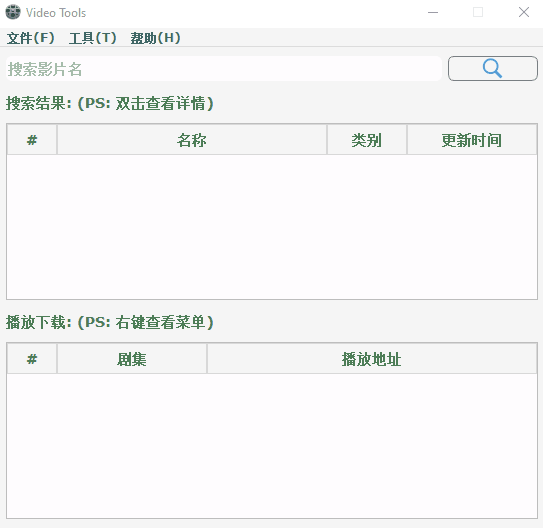

#### videoTool
   

|Author|:sunglasses:lucas234:sunglasses:|
|---|---|
|Email|:hearts:ly_liubo@163.com:hearts:|

****
#### :monkey:声明
**软件均仅用于学习交流，请勿用于任何商业用途！感谢大家！**

#### :monkey:介绍
本来只是想写一个简单的下载`M3U8`链接为`mp4`格式的工具，结果写着写着又添加了一些额外的功能，
也算是用来学习代码了，里边还有一些功能没有实现，后续有时间了会优化的，想写一个Android版本的，
这样就可以用来方便一点了。。。

该项目为一个视频搜索工具，支持播放、下载：
- **播放视频:支持播放M3U8类型的url、以及其他[VLC](https://www.videolan.org/) 支持格式的视频（内嵌[VLC](https://www.videolan.org/) 的播放器）**
- **下载视频:支持下载M3U8类型的url，可以搜索影片，选择下载**

#### 🐒 直接运行
1.下载文件：[地址](https://github.com/lucas234/videoTool/releases/tag/videoTool-1.0)

2.解压，打开`videoTool.exe`即可

#### :monkey: 本地运行
1.克隆代码到本地`git clone git@github.com:lucas234/videoTool.git`

2.安装依赖库`pip install -r requirements.txt`

3.直接运行`video_tools.py`文件或者运行`package.py` 打包

#### :monkey:运行截图

#### :monkey:**总结**
> **最后，如果你觉得这个项目不错或者对你有帮助，给个Star呗，也算是对我学习路上的一种鼓励！ 
>  哈哈哈，感谢大家！笔芯哟~**:cupid::cupid:

#### :monkey:pyqt5总结
[QtDesigner用法](docs/designer.md) 

[resources文件用法](docs/resources.md)

#### :monkey:参考
1. pyinstaller
   - https://pyinstaller.readthedocs.io/en/stable/usage.html
   - https://www.mfitzp.com/tutorials/packaging-pyqt5-pyside2-applications-windows-pyinstaller/

